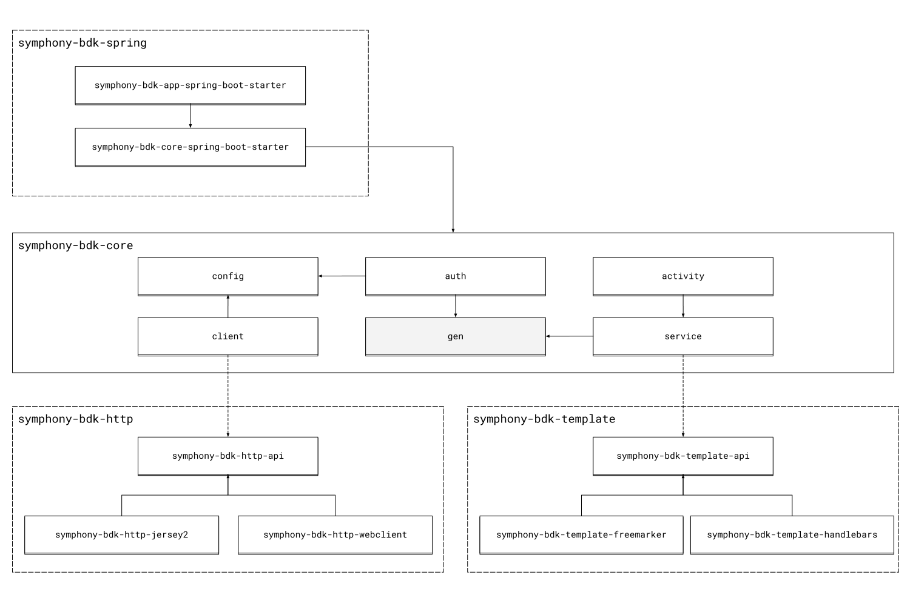

# BDK Architecture Presentation
The Symphony BDK for Java is a multi-module library that uses [Gradle](https://gradle.org/) as build system. 
This page will help new contributors to clearly understand how the library has been designed.

## Architecture Overview

